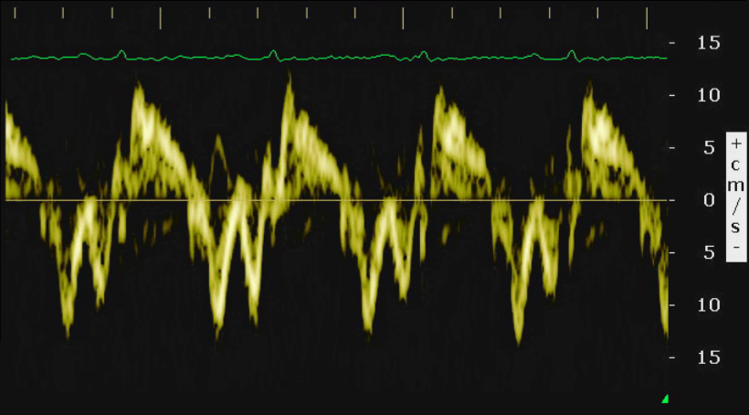

# Cardiotoxicidad en cáncer de mama: modelos de curación con datos clínicos y ECG

Código de mi Trabajo de Fin de Grado en Ciencia e Ingeniería de Datos (Universidade da Coruña, 2026).

El objetivo es predecir la cardiotoxicidad relacionada con el tratamiento (CTRCD) en pacientes con cáncer de mama. Parto de las variables clínicas del conjunto *BC_cardiotox* y de las imágenes de ecocardiografía, de las que extraigo la señal del ECG. Como buena parte de las pacientes nunca llega a desarrollar el evento, en lugar de un Cox clásico uso **modelos de curación**, que separan la probabilidad de sufrir cardiotoxicidad del momento en que aparece.

En resumen, el trabajo tiene tres partes:

1. **Extracción de la curva del ECG** a partir de las imágenes: recorte de la región de interés, segmentación del trazo verde en HSV, reconstrucción de la señal por columnas y descarte de las curvas que no se pueden recuperar.
2. **Análisis descriptivo**: variables clínicas, Kaplan-Meier y análisis funcional de las curvas (FPCA).
3. **Modelización**: modelos de mixtura de curación (`smcure`) con variables clínicas, componentes funcionales o ambas, un modelo *single-index* con la señal completa (`sicure`) y comparación por C-index con validación cruzada repetida.

<p align="center"></p>

## Estructura

```
python/             Extracción del ECG y análisis descriptivo de las variables clínicas
  config.py           rutas y constantes compartidas
  config_recortes.py  recorte manual de cada imagen
  extraer_ecg.py
  eda_analysis.py
R/                  Análisis funcional y modelización
  tfg_comun.R         carga de datos, FPCA, ajustes y figuras comunes (lo usan los demás)
  curacion_lib.R      selección hacia atrás y smcure con covariables distintas
  ...                 un guion por apartado (ver abajo)
  diagnostico/        comprobaciones del bootstrap, del cribado y de las cifras
notebooks/          Notebooks de las primeras pruebas (sin salidas)
datos/              Aquí van los CSV originales (no se incluyen, ver datos/README.md)
docs/img/           Imágenes de apoyo
```

Al ejecutar los scripts se crean además `IMAGES/` (imágenes de entrada), `RESULTADOS_ECG/` (curvas extraídas y modelos), `cache/` (ajustes lentos) y `salidas/` (figuras y tablas en LaTeX). Ninguna se versiona.

## Datos

El conjunto *BC_cardiotox* es público y procede del Complejo Hospitalario Universitario de A Coruña. Está descrito en:

> Piñeiro-Lamas, B. et al. *A cardiotoxicity dataset for breast cancer patients*. Scientific Data 10, 527 (2023).

Las instrucciones para descargarlo y colocarlo están en [`datos/README.md`](datos/README.md).

## Requisitos

- Python 3.10 o superior: `pip install -r requirements.txt`
- R 4.x con `readr`, `fda`, `survival`, `survminer`, `smcure`, `sicure` y `npcure`:

```r
install.packages(c("readr", "fda", "survival", "survminer", "smcure", "sicure", "npcure"))
```

## Ejecución

Todos los comandos se lanzan desde la raíz del repositorio. El orden importa, porque cada paso usa lo que deja el anterior.

```bash
# 1. Curvas ECG -> RESULTADOS_ECG/senales_ecg_full.csv
python python/extraer_ecg.py            # añadir --figuras para las figuras del capítulo

# 2. Descriptivo de las variables clínicas
python python/eda_analysis.py

# 3. Kaplan-Meier y FPCA
Rscript R/eda_funcional_superv.R

# 4. Contraste de seguimiento suficiente, Cox de referencia y primera versión de los modelos de curación
Rscript R/modelizacion_curacion.R

# 5. Modelos de curación definitivos
Rscript R/seleccion_backward.R          # M1: variables clínicas, eliminación hacia atrás
Rscript R/modelizacion_funcional.R      # M2 y M3: 8 componentes funcionales (+ clínicas)
Rscript R/cindex_v2.R                   # comparación por C-index

# 6. Modelos single-index (lentos: ~9 min por ajuste, se guardan en cache/)
Rscript R/modelizacion_sicure.R
Rscript R/modelizacion_sicure_todos.R
Rscript R/figura_beta_semillas.R

# 7. Comparación de las submuestras (posible sesgo de selección)
Rscript R/representatividad.R
```

Si se cambia el preprocesado de `tfg_comun.R` hay que borrar `cache/` a mano, porque la caché no detecta el cambio.

Con los datos originales, el paso 1 debería dar 194 curvas válidas (168 sin CTRCD y 26 con CTRCD) y 76 descartadas de las 270 imágenes.

## Reproducibilidad

Todo lo aleatorio lleva semilla fija: `np.random.RandomState(7)` en la muestra de curvas, `set.seed(42)` en el descriptivo en R, `set.seed(1)` en el bootstrap de `smcure` y `set.seed(20260810)` en la validación cruzada. La semilla del bootstrap solo se fija cuando se piden errores estándar; fijarla en cada ajuste haría que todas las repeticiones de la validación cruzada usaran la misma partición.

## Autor

Ricardo Martín Buba Sopko
